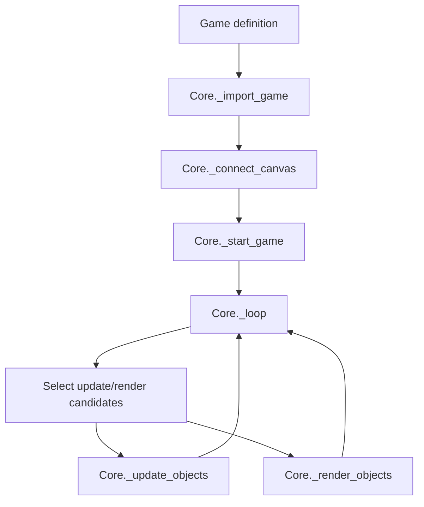
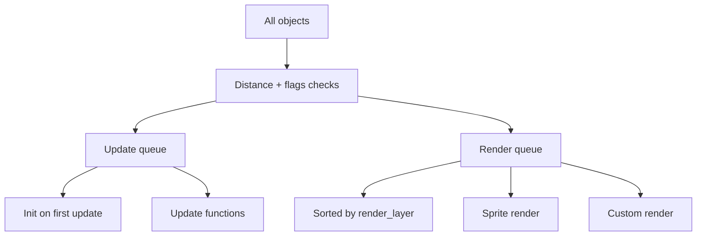
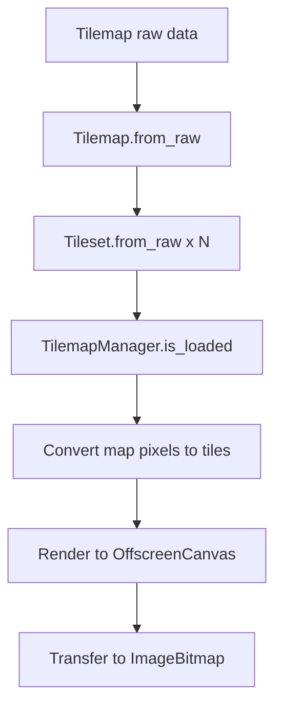
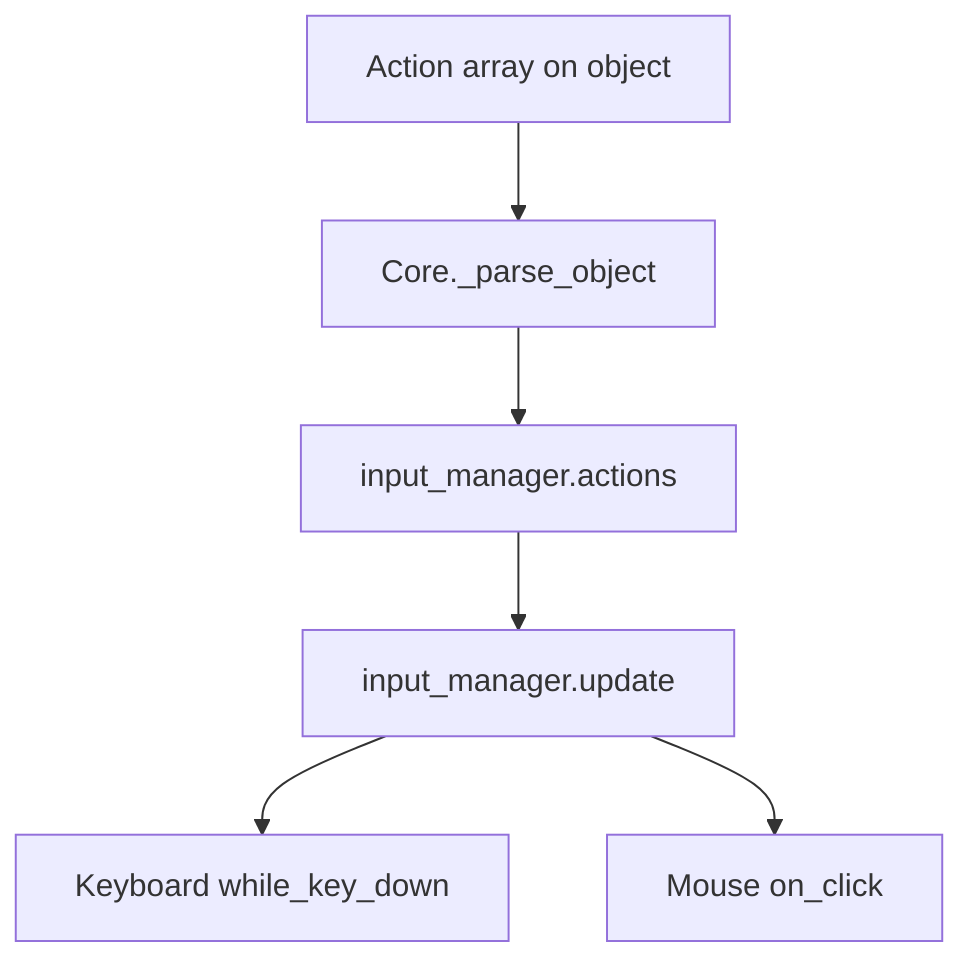

# S2D Engine Documentation

This document describes the complete API surface of the S2D engine located in `client/s2d_engine`. It includes every property and method defined in the engine code, along with lifecycle diagrams and raw object schemas.

## Overview

S2D is a lightweight JavaScript 2D engine built around a central `Core` loop. You supply a game object describing the objects and internal systems to import; the engine parses those objects into `GameObject` instances, tracks them in update/render queues, and renders to an HTML canvas. Optional systems for input handling, UI helpers, and tilemap rendering are implemented as internal objects.

## Diagrams

### Core lifecycle

### Update/render pipeline

### Tilemap loading

### Input actions

## Game definition (input to Core)

The engine expects a game definition object with these top-level fields:

- `internal_objects`: array of strings identifying internal systems to import. Supported values are `input_manager`, `tilemap_manager`, and `ui_manager`.
- `objects`: array of raw object definitions. Each raw object is parsed by `Core._parse_object` into a `GameObject` instance.
- `tilemap`: raw tilemap definition. Used only when `internal_objects` includes `tilemap_manager`.

## Core class

Source: `client/s2d_engine/core.js`

### Properties

| Property | Type | Default | Description |
| --- | --- | --- | --- |
| `_main_canvas` | object | `{ element:null, context:null, fullscreen:false }` | Canvas wrapper. |
| `_main_canvas.element` | `HTMLCanvasElement|null` | `null` | Connected canvas element. |
| `_main_canvas.context` | `CanvasRenderingContext2D|null` | `null` | 2D drawing context for the main canvas. |
| `_main_canvas.fullscreen` | `boolean` | `false` | If `true`, canvas is resized to window size in the loop. |
| `_frames_per_second` | `number` | `0` | Unused legacy field; FPS is tracked in `_current_frames_per_second`. |
| `_current_frames_per_second` | `number` | `0` | Instantaneous FPS computed each frame in `_loop`. |
| `_frame_record` | `number[]` | `[]` | Rolling record of the last 100 FPS samples. |
| `_average_frames_per_second` | `number` | `0` | Average FPS over `_frame_record`. |
| `flags` | object | `{ RENDER_COLLISION_BOXES:false }` | Engine-level debug flags. |
| `_objects` | `Record<string, GameObject>` | `{}` | Registry of all objects (game + internal). Keys are identifiers used by `_get_object_by_identifier`. |
| `_player_object_identifier` | `string|null` | `null` | Identifier for the player object, used for camera and distance checks. |
| `_camera_position` | `Vector2D` | `Vector2D.ZERO()` | Top-left global position of the camera. |
| `_camera_offset` | `Vector2D` | `Vector2D.ZERO()` | Offset applied to camera position (not used in the loop). |
| `_canvas_center` | `Vector2D` | `Vector2D.ZERO()` | Half-size of the canvas, updated on resize. |
| `_update_queue` | `Array<{self:GameObject, update_function:function}>` | `[]` | Queue of objects scheduled for update in the current frame. |
| `_render_queue` | `Array<{self:GameObject}>` | `[]` | Queue of objects scheduled for render in the current frame. |
| `_update_distance` | `number` | `1500` | Distance from player to include objects in update queue. |
| `_render_distance` | `number` | `3000` | Distance from player to include objects in render queue. |
| `_out_of_focus` | `boolean` | `false` | Set by window blur/focus events to pause simulation. |
| `_last_time` | `number` | `undefined` | Timestamp from previous frame; set in `_loop`. |
| `_current_time` | `number` | `undefined` | Current timestamp; set in `_loop`. |
| `_delta_time` | `number` | `undefined` | Delta time in seconds for the current frame. |
| `_updated_objects_count` | `number` | `undefined` | Number of objects updated in the current frame. |
| `_rendered_objects_count` | `number` | `undefined` | Number of objects rendered in the current frame. |

### Methods

| Method | Signature | Description |
| --- | --- | --- |
| `_import_game` | `(game)` | Imports internal objects and raw game objects. Logs warnings if objects are missing or unknown. |
| `_import_objects` | `(raw_objects)` | Spawns an array of raw objects. |
| `_spawn_object` | `(raw_object)` | Parses and registers a raw object by identifier. |
| `_destroy_object` | `(identifier)` | Removes an object from `_objects` if found; logs a warning if not. |
| `_parse_object` | `(raw_object) => GameObject` | Converts raw object definition to `GameObject` instance; attaches sprites, flags, collision boxes, actions, and custom properties. |
| `_connect_canvas` | `(id, fullscreen)` | Connects an HTML canvas by DOM id and stores its 2D context. |
| `_get_mouse_position` | `() => Vector2D` | Reads mouse position from `input_manager` and returns it as a vector. Uses identifier `INTERNAL_input_manager` in lookup. |
| `_update_camera_position` | `() => void` | Sets `_camera_position` based on player object position and `_canvas_center`. |
| `_global_to_screen` | `(global_position) => Vector2D` | Converts global world coordinates to screen coordinates by subtracting `_camera_position`. |
| `_screen_to_global` | `(screen_position) => Vector2D` | Converts screen coordinates to global coordinates by adding `_camera_position`. |
| `_loop` | `() => void` | Main engine loop: computes delta, queues objects, updates, renders, and requests next frame. |
| `_get_object_by_identifier` | `(identifier) => GameObject|false` | Looks up objects by key in `_objects` registry. |
| `_get_objects_by_identifier` | `(identifier) => GameObject[]` | Attempts to return all objects with a matching `identifier` by iterating `_objects`. Currently assumes `_objects` is iterable; if it is a map, this returns an empty array. |
| `_get_objects_by_group` | `(group) => GameObject[]` | Attempts to return all objects with matching `group` by iterating `_objects`. Currently assumes `_objects` is iterable. |
| `_start_game` | `() => void` | Registers focus listeners and starts the animation loop. |
| `_add_to_update_queue` | `(object, update_function)` | Adds an object to the update queue with its update function. |
| `_add_to_render_queue` | `(object)` | Adds an object to the render queue. |
| `_update_objects` | `(delta)` | Initializes objects on first update, applies spawn tiles, and runs update callbacks. Updates camera for player. |
| `_get_spawn_position` | `(tile_identifier) => Vector2D` | Returns a random tile center from the tilemap manager with matching identifier. |
| `_render_objects` | `() => void` | Sorts by render layer, renders sprites, runs custom render, optionally draws collision boxes. |

### Behavior notes

- The player object identifier is set when a raw object includes the `IS_PLAYER` flag.
- Update/render queues are rebuilt every frame based on distance to the player and object flags.
- Internal objects are registered under the names provided in `game.internal_objects` (e.g., `input_manager`), while their internal `GameObject.identifier` values are `INTERNAL_*`. Calls to `_get_object_by_identifier` only use the registry key.

## GameObject class

Source: `client/s2d_engine/utils/game_object.js`

### Properties

| Property | Type | Default | Description |
| --- | --- | --- | --- |
| `identifier` | `string` | constructor arg | Object identifier string. |
| `_is_initialized` | `boolean` | `false` | Set to `true` after `init` is run in `_update_objects`. |
| `flags` | object | `{ ALWAYS_UPDATE:false, ALWAYS_RENDER:false, IS_PLAYER:false, USE_SPRITE:false }` | Behavior flags recognized by `Core` and internal systems. |
| `global_position` | `Vector2D` | `Vector2D.ZERO()` | World position of the object. |
| `bounding_box` | `Vector4D` | `Vector4D.ZERO()` | Bounding box (not used by core). |
| `collision_box` | `Vector4D` | `Vector4D.ZERO()` | Collision box; rendered in debug mode. |
| `render_layer` | `number` | `0` | Sort key for render order. Higher renders on top. |

### Methods

| Method | Signature | Description |
| --- | --- | --- |
| `init` | `(self)` | No-op default. Called once before the first update. |
| `update` | `(self, delta)` | No-op default. Called each frame when queued for update. |
| `render` | `(self, context, position)` | No-op default. Called each frame when queued for render. |

## Vector utilities

Source: `client/s2d_engine/utils/vectors.js`

### Vector2D

#### Properties

| Property | Type | Description |
| --- | --- | --- |
| `x` | `number` | X component. |
| `y` | `number` | Y component. |

#### Methods

| Method | Signature | Description |
| --- | --- | --- |
| `add` | `(vector2d) => Vector2D` | Returns `this + vector2d`. |
| `subtract` | `(vector2d) => Vector2D` | Returns `this - vector2d`. |
| `multiply` | `(vector2d) => Vector2D` | Component-wise multiply. |
| `scale` | `(scalar) => Vector2D` | Scales both components by a number. |
| `divide` | `(number) => Vector2D` | Divides components by number; returns zero vector if number is falsy. |
| `magnitude` | `() => number` | Euclidean length. |
| `normalize` | `() => Vector2D` | Returns a unit vector. |
| `limit` | `(limit) => Vector2D` | Caps magnitude to limit. |
| `floor` | `() => Vector2D` | Floors both components. |
| `distance` | `(vector2d) => number` | Distance between vectors. |
| `angle` | `() => number` | Angle in radians from origin to vector. |

#### Static methods

| Method | Signature | Description |
| --- | --- | --- |
| `ZERO` | `() => Vector2D` | `(0,0)` vector. |
| `LEFT` | `() => Vector2D` | `(-1,0)` vector. |
| `RIGHT` | `() => Vector2D` | `(1,0)` vector. |
| `UP` | `() => Vector2D` | `(0,-1)` vector. |
| `DOWN` | `() => Vector2D` | `(0,1)` vector. |
| `from_x_and_y` | `(x,y) => Vector2D` | Creates a vector from components. |
| `from_angle` | `(angle) => Vector2D` | Unit vector from angle in radians. |
| `copy` | `(vector2d) => Vector2D` | Clones a vector. |

### Vector4D

#### Properties

| Property | Type | Description |
| --- | --- | --- |
| `x` | `number` | X component. |
| `y` | `number` | Y component. |
| `width` | `number` | Width component. |
| `height` | `number` | Height component. |

#### Static methods

| Method | Signature | Description |
| --- | --- | --- |
| `ZERO` | `() => Vector4D` | `(0,0,0,0)` vector. |
| `from_vector2d` | `(vector2d) => Vector4D` | Uses `vector2d` for x,y and zeros for size. |
| `from_vector2d_and_size` | `(vector2d, size) => Vector4D` | Uses `vector2d` for x,y and `size` for width,height. |
| `from_vector2d_and_width_and_height` | `(vector2d, width, height) => Vector4D` | Uses `vector2d` for x,y and explicit size. |
| `from_x_and_y_and_width_and_height` | `(x,y,width,height) => Vector4D` | Creates from components. |
| `from_width_and_height` | `(width,height) => Vector4D` | Creates at origin with size. |
| `from_size` | `(size) => Vector4D` | Creates at origin using `size.x`, `size.y`. |
| `copy` | `(vector4d) => Vector4D` | Clones a vector. |

## Tileset

Source: `client/s2d_engine/utils/tileset.js`

### Properties

| Property | Type | Default | Description |
| --- | --- | --- | --- |
| `identifier` | `string` | constructor arg | Tileset identifier. |
| `map_color` | `{r:number,g:number,b:number,a:number}` | `{0,0,0,0}` | RGBA color used to map pixels to tiles. |
| `tileset_path` | `string` | `""` | Path to tileset image. |
| `tileset_image` | `Image|null` | `null` | Loaded image element. |
| `tile_width` | `number` | `0` | Width of a single tile in source image. |
| `tile_height` | `number` | `0` | Height of a single tile in source image. |
| `tileset_width` | `number` | `0` | Total source image width in pixels. |
| `tileset_height` | `number` | `0` | Total source image height in pixels. |
| `tileset_columns` | `number` | `0` | Number of columns in source image. |
| `tileset_rows` | `number` | `0` | Number of rows in source image. |
| `loaded` | `boolean` | `false` | Set to `true` when `tileset_image` loads. |
| `is_collider` | `boolean` | `undefined` | Optional flag; set only if provided by raw tileset. |

### Methods

| Method | Signature | Description |
| --- | --- | --- |
| `from_raw` | `(raw_tileset) => Tileset` | Creates a tileset from raw JSON, loads image, and sets `loaded` on image load. |

## Tilemap

Source: `client/s2d_engine/utils/tilemap.js`

### Properties

| Property | Type | Default | Description |
| --- | --- | --- | --- |
| `map_path` | `string` | `""` | Path to tilemap image. |
| `map_image` | `Image|null` | `null` | Loaded map image. |
| `tilesets` | `Tileset[]` | `[]` | Tilesets used in the map. |
| `map_image_loaded` | `boolean` | `false` | Set to `true` when map image loads. |
| `map_width` | `number` | `undefined` | Width in tiles (from raw). |
| `map_height` | `number` | `undefined` | Height in tiles (from raw). |
| `scale` | `number` | `undefined` | Global scale factor for tile rendering. |
| `tile_width` | `number` | `undefined` | Base tile width from raw data. |
| `tile_height` | `number` | `undefined` | Base tile height from raw data. |

### Methods

| Method | Signature | Description |
| --- | --- | --- |
| `are_tilesets_loaded` | `() => boolean` | Returns `true` if all tilesets have loaded images. |
| `add_tileset` | `(tileset)` | Adds a tileset to the tilemap. |
| `is_loaded` | `() => boolean` | Returns `true` when `map_image_loaded` and all tilesets are loaded. |
| `from_raw` | `(raw_tilemap) => Tilemap` | Creates a tilemap from raw JSON and loads map/tilesets. |

## Internal objects

Internal objects are `GameObject` instances used by the engine. They are created in `client/s2d_engine/internal_objects` and added by `Core._import_game`.

### input_manager

Source: `client/s2d_engine/internal_objects/input_manager.js`

#### Properties

| Property | Type | Default | Description |
| --- | --- | --- | --- |
| `identifier` | `string` | `INTERNAL_input_manager` | GameObject identifier. |
| `flags.ALWAYS_UPDATE` | `boolean` | `true` | Ensures input updates even when far from player. |
| `keymap` | `Record<string, boolean>` | `{}` | Key state map. Cleared on blur/context menu. |
| `actions` | `Array<object>` | `[]` | Actions registered from object definitions. |
| `mouse` | `{x:number,y:number,left_down:boolean,right_down:boolean}` | `{0,0,false,false}` | Mouse position and button state. |

#### Methods

| Method | Signature | Description |
| --- | --- | --- |
| `is_key_down` | `(self, key) => boolean` | Returns current key state from `keymap`. |
| `init` | `(core, self)` | Initializes keymap/actions/mouse and adds window input listeners. |
| `update` | `(core, self, delta)` | Dispatches actions, manages cooldown timers, and handles mouse buttons. |

### tilemap_manager

Source: `client/s2d_engine/internal_objects/tilemap_manager.js`

#### Properties

| Property | Type | Default | Description |
| --- | --- | --- | --- |
| `identifier` | `string` | `INTERNAL_tilemap_manager` | GameObject identifier. |
| `flags.ALWAYS_UPDATE` | `boolean` | `true` | Always updates. |
| `flags.ALWAYS_RENDER` | `boolean` | `true` | Always renders. |
| `ready` | `boolean` | `false` | Becomes `true` after tilemap is fully processed and rendered. |
| `tilemap` | `Tilemap` | `undefined` | Parsed tilemap from raw data. |
| `map` | `Array<{x:number,y:number,tileset:Tileset|false}>` | `undefined` | Pixel-to-tile mapping for each tile coordinate. |
| `rendered_map` | `OffscreenCanvas` | `undefined` | Offscreen canvas containing rendered tiles. |
| `rendered_map_image` | `ImageBitmap` | `undefined` | Image bitmap created from `rendered_map`. |

#### Methods

| Method | Signature | Description |
| --- | --- | --- |
| `is_loaded` | `(self) => boolean` | Builds tilemap rendering on first ready check; returns `true` when ready. |
| `init` | `(core, self, raw_tilemap)` | Parses raw tilemap data into `Tilemap`. |
| `is_colliding` | `(self, position, height) => boolean` | Checks if a point/height intersects a collider tile. |
| `get_tiles` | `(self, identifier) => Array<{global_position:{x,y}}>|false` | Returns center positions of tiles with matching tileset identifier. |
| `tile_identifier_to_global_position` | `(self, tile_identifier) => {x,y}|false` | Returns top-left position of a matching tile. |
| `render` | `(core, self, context, position)` | Draws the pre-rendered tilemap image. |
| `convert_map_image` | `(self) => Array` | Converts pixel data into `map` entries with tileset references. |
| `pixeldata_to_tile` | `(self, pixeldata) => Tileset|false` | Matches pixel RGBA to tileset `map_color`. |

### ui_manager

Source: `client/s2d_engine/internal_objects/ui_manager.js`

#### Properties

| Property | Type | Default | Description |
| --- | --- | --- | --- |
| `identifier` | `string` | `INTERNAL_ui_manager` | GameObject identifier. |
| `flags.ALWAYS_UPDATE` | `boolean` | `true` | Always updates. |
| `flags.ALWAYS_RENDER` | `boolean` | `true` | Always renders. |
| `colors` | `object` | `{ text:"white" }` | UI color palette. |

#### Methods

| Method | Signature | Description |
| --- | --- | --- |
| `init` | `(core, self)` | Initializes UI color palette. |
| `getElement` | `(identifier) => HTMLElement|false` | Returns element by ID. |
| `setInnerHTML` | `(self, identifier, content)` | Updates element `innerHTML` if present. |
| `toggleVisibility` | `(self, identifier)` | Toggles element `style.visibility`. |
| `setVisibility` | `(self, identifier, visibility)` | Sets element `style.visibility` to provided value. |
| `_get_visibility` | `(self, identifier) => string|false` | Returns element visibility or `false`. |
| `_get_elements` | `(class_name) => HTMLCollection` | Returns elements by class name; logs to console. |
| `_get_number_from` | `(id) => number` | Reads and converts an element's innerHTML to a number. |

## Raw object schema (`Core._parse_object`)

Raw objects are plain JS objects passed in `game.objects`. The parser creates a `GameObject` and copies specific fields or transforms them.

### Supported fields

| Field | Type | Description |
| --- | --- | --- |
| `identifier` | `string` | Required unique identifier; used as key in `_objects`. |
| `flags` | `string[]` | Flag names applied to `GameObject.flags` and used by core. Includes `IS_PLAYER`, `ALWAYS_UPDATE`, `ALWAYS_RENDER`, `USE_SPRITE`. |
| `sprite` | object | Enables sprite rendering. See sprite fields below. |
| `collision_box` | `{x,y,width,height}` | Converted into a `Vector4D` and stored on `collision_box`. |
| `group` | `string` | Optional grouping string for `_get_objects_by_group`. |
| `global_position` | `{x,y}` | Converted to `Vector2D`. Defaults to `Vector2D.ZERO()`. |
| `spawn_tile` | `string` | Tile identifier used to place object at a random matching tile. |
| `render_layer` | `number` | Sets render order. |
| `init` | `function` | Lifecycle init function. |
| `update` | `function` | Per-frame update function. |
| `render` | `function` | Per-frame render function. |
| `actions` | `Array<object>` | Input actions registered with `input_manager`. |
| `...any` | `any` | Any additional properties are copied directly to the `GameObject`. |

### Sprite fields

| Field | Type | Description |
| --- | --- | --- |
| `image_path` | `string` | Path to sprite image. |
| `width` | `number` | Source width in image (used for render defaults). |
| `height` | `number` | Source height in image (used for render defaults). |
| `render_width` | `number` | Render width; defaults to `width`. |
| `render_height` | `number` | Render height; defaults to `height`. |

### Action fields

Keyboard action:

- `type`: `"keyboard"`
- `key`: string key name (e.g., `"w"`)
- `while_key_down`: function `(core, self)`
- `cooldown`: optional boolean; when true, a `cooldownTimer` is initialized at 0 and set to 30 frames after each activation

Mouse action:

- `type`: `"mouse"`
- `button`: `"left"` or `"right"`
- `on_click`: function `(core, self)`

## Render and update behavior

- Objects are added to update/render queues each frame if:
  - `flags.ALWAYS_UPDATE` or `flags.ALWAYS_RENDER` is set, or
  - Their `global_position` is within `_update_distance`/`_render_distance` of the player.
- Player camera tracking occurs after updating the player object each frame.
- Sprites are rendered centered on object position; rotation uses `self.rotation` or `self.sprite_angle`.
- Collision boxes are drawn only when `core.flags.RENDER_COLLISION_BOXES` is `true`.

## Known integration details

- Internal objects are registered in `_objects` under keys `input_manager`, `tilemap_manager`, and `ui_manager`. Their `GameObject.identifier` values are `INTERNAL_*`, but lookups should use the registry keys.
- `Core._get_mouse_position`, `Core._get_spawn_position`, and tilemap load checks reference `INTERNAL_*` identifiers. In current code, these lookups return `false` unless the internal objects are also registered under those keys.
